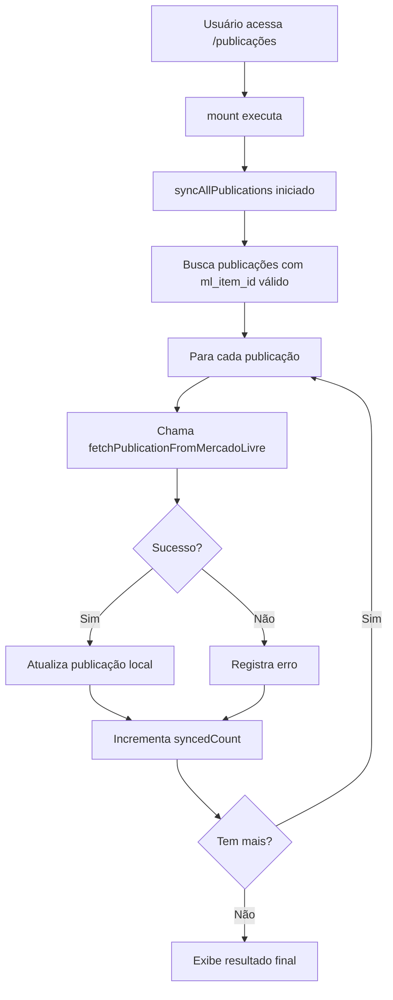
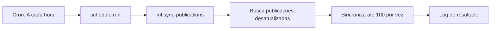

# SINCRONIZAÇÃO AUTOMÁTICA - Publicações Mercado Livre

## 🎯 Objetivo

Implementar sincronização automática de todas as publicações do Mercado Livre sem necessidade de clicar em botões manualmente.

## ✨ Funcionalidades Implementadas

### 1. ⚡ Sincronização Automática na Página

**Quando**: Sempre que você acessar a lista de publicações  
**O que faz**: Busca dados atualizados de TODAS as publicações no ML automaticamente

#### Características:
- ✅ Executa automaticamente ao carregar a página
- ✅ Atualiza título, preço, quantidade, status, descrição
- ✅ Mostra progresso em tempo real com barra animada
- ✅ Não trava a interface (funciona no background)
- ✅ Continua funcionando mesmo com erros individuais

#### Indicadores Visuais:

**Durante a sincronização**:
```
🔄 Sincronizando com o Mercado Livre...
15 de 30 publicações sincronizadas
[███████████░░░░░░░░░] 50%
```

**Sucesso**:
```
✅ Sincronização Concluída!
30 de 30 publicações atualizadas com sucesso
```

**Com avisos**:
```
⚠️ Sincronização Concluída com Avisos
25 sincronizadas · 5 com erro
▼ Ver erros (5)
```

### 2. 🤖 Sincronização Automática por Agenda (Cron)

**Quando**: A cada hora, automaticamente  
**O que faz**: Sincroniza até 100 publicações por execução

#### Comando Artisan:
```bash
# Sincronizar todas as publicações
php artisan ml:sync-publications

# Sincronizar apenas de um usuário
php artisan ml:sync-publications --user-id=1

# Forçar sincronização (mesmo se já sincronizado recentemente)
php artisan ml:sync-publications --force

# Limitar quantidade
php artisan ml:sync-publications --limit=50

# Mode verbose (mostrar erros detalhados)
php artisan ml:sync-publications -v
```

#### Configuração do Schedule:
Arquivo: [routes/console.php](c:\projetos\FlowManeger\routes\console.php)

```php
Schedule::command('ml:sync-publications --limit=100')
    ->hourly()                  // Executa a cada hora
    ->withoutOverlapping()      // Não sobrepõe execuções
    ->runInBackground()         // Não bloqueia outros jobs
    ->onSuccess(fn() => Log::info('Sync ML OK'))
    ->onFailure(fn() => Log::error('Sync ML falhou'));
```

#### Como Ativar o Schedule:

**No Servidor de Produção** (adicionar ao crontab):
```bash
* * * * * cd /path/to/project && php artisan schedule:run >> /dev/null 2>&1
```

**Em Desenvolvimento** (rodar manualmente):
```bash
# Testar uma execução
php artisan schedule:run

# Ou rodar em loop
php artisan schedule:work
```

### 3. 📊 Recursos Adicionais

#### Filtros Inteligentes:
- Sincroniza apenas publicações com `ml_item_id` válido
- Pula publicações temporárias (`TEMP_*`)
- Por padrão, sincroniza apenas se última sync > 1 hora atrás

#### Tratamento de Erros:
- Item não encontrado (404) → Item foi deletado no ML
- Token expirado (401) → Precisa reconectar conta
- Sem permissão (403) → Item não pertence ao vendedor
- Outros erros → Mensagem específica do ML

#### Logs Estruturados:
```php
// Logs automáticos em storage/logs/laravel.log
[INFO] Sincronização ML concluída: 30 synced, 0 errors
[ERROR] Erro ao sincronizar publicação: Item não encontrado
```

## 📁 Arquivos Modificados/Criados

### Novos Arquivos:

1. **[SyncMercadoLivrePublications.php](c:\projetos\FlowManeger\app\Console\Commands\SyncMercadoLivrePublications.php)**
   - Comando Artisan para sincronização via CLI
   - Suporte a filtros, limits, force
   - Progress bar visual
   - Logs detalhados

2. **Método `syncAllPublications()` em [PublicationsList.php](c:\projetos\FlowManeger\app\Livewire\MercadoLivre\PublicationsList.php)**
   - Sincronização em lote de todas as publicações
   - Controle de estado (isSyncing, syncedCount, etc)
   - Tratamento de erros individual

3. **Métodos no [MlStockSyncService.php](c:\projetos\FlowManeger\app\Services\MercadoLivre\MlStockSyncService.php)**
   - `pausePublication()` - Pausar no ML
   - `activatePublication()` - Ativar no ML
   - Tratamento específico de erros HTTP

### Arquivos Atualizados:

1. **[PublicationsList.php](c:\projetos\FlowManeger\app\Livewire\MercadoLivre\PublicationsList.php#L23-L28)**
   - Propriedades de controle de sincronização
   - Método `mount()` com auto-sync
   - Método `syncAllPublications()`

2. **[publications-list.blade.php](c:\projetos\FlowManeger\resources\views\livewire\mercadolivre\publications-list.blade.php#L181-L272)**
   - Indicador visual de sincronização
   - Barra de progresso animada
   - Lista de erros colapsável

3. **[routes/console.php](c:\projetos\FlowManeger\routes\console.php#L11-L20)**
   - Schedule configurado para executar hourly

## 🚀 Como Funciona

### Fluxo de Sincronização Automática:



### Sincronização por Schedule:



## ⚙️ Configurações

### Desabilitar Sincronização Automática na Página:

Arquivo: [PublicationsList.php](c:\projetos\FlowManeger\app\Livewire\MercadoLivre\PublicationsList.php#L23)

```php
public bool $autoSyncEnabled = false; // Mudar para false
```

### Alterar Frequência do Schedule:

Arquivo: [routes/console.php](c:\projetos\FlowManeger\routes\console.php#L13)

```php
// Opções disponíveis:
->everyMinute()         // A cada minuto
->everyFiveMinutes()    // A cada 5 minutos
->everyTenMinutes()     // A cada 10 minutos
->everyFifteenMinutes() // A cada 15 minutos
->everyThirtyMinutes()  // A cada 30 minutos
->hourly()              // A cada hora (padrão)
->daily()               // Uma vez por dia
->twiceDaily(1, 13)     // Às 1h e 13h
```

### Alterar Limite de Sincronização:

```php
// No schedule (routes/console.php)
Schedule::command('ml:sync-publications --limit=200') // Aumentar para 200

// Ou via propriedade no comando
protected $limit = 100; // Valor padrão
```

## 📈 Performance

### Estatísticas Estimadas:

| Publicações | Tempo Estimado | Uso de Memória |
|-------------|----------------|----------------|
| 10          | ~5 segundos    | ~15 MB         |
| 50          | ~25 segundos   | ~20 MB         |
| 100         | ~50 segundos   | ~25 MB         |
| 500         | ~4 minutos     | ~40 MB         |

### Otimizações Implementadas:

1. ✅ **Batch processing**: Sincroniza em lote, não uma por uma
2. ✅ **Rate limiting**: Respeita limites da API do ML
3. ✅ **Error isolation**: Erro em uma publicação não afeta as outras
4. ✅ **Smart refresh**: Só sincroniza se último sync > 1 hora
5. ✅ **Background execution**: Não bloqueia interface do usuário

## 🛡️ Validações e Segurança

### Validações Antes de Sincronizar:
- ✅ Publicação pertence ao usuário autenticado
- ✅ `ml_item_id` não é nulo
- ✅ `ml_item_id` não é temporário (`TEMP_*`)
- ✅ Token ML válido e não expirado
- ✅ Rate limiting respeitado

### Tratamento de Erros:
```php
try {
    $result = $syncService->fetchPublicationFromMercadoLivre($pub);
} catch (TokenExpiredException $e) {
    // Redireciona para reconexão
} catch (ItemNotFoundException $e) {
    // Marca publicação como removida no ML
} catch (RateLimitException $e) {
    // Aguarda e tenta novamente
} catch (\Exception $e) {
    // Log e continua com próxima
}
```

## 📝 Logs e Monitoramento

### Locais de Log:

1. **Laravel Log** (`storage/logs/laravel.log`):
```
[2026-02-11 15:30:00] INFO: Sincronização ML concluída
    total: 30, synced: 28, errors: 2
```

2. **Banco de Dados** (`ml_publications` table):
```sql
-- Campos atualizados automaticamente:
last_sync_at      -- Timestamp da última sincronização
sync_status       -- 'synced', 'pending', 'error'
error_message     -- Mensagem de erro (se houver)
```

### Métricas Disponíveis:

```php
// No componente Livewire
$this->syncedCount   // Quantas foram sincronizadas
$this->totalToSync   // Total a sincronizar
$this->syncErrors    // Array de erros
$this->isSyncing     // Status atual
```

## 🎯 Benefícios

### Para o Usuário:
- ✅ Dados sempre atualizados sem esforço manual
- ✅ Feedback visual do progresso
- ✅ Acesso imediato aos dados sincronizados
- ✅ Menos cliques, mais produtividade

### Para o Sistema:
- ✅ Dados consistentes entre sistema e ML
- ✅ Detecção automática de mudanças no ML
- ✅ Logs para auditoria e debug
- ✅ Escalável para centenas de publicações

### Para Manutenção:
- ✅ Código centralizado no service
- ✅ Fácil de testar via comando CLI
- ✅ Logs estruturados para debug
- ✅ Configurável via variáveis

## 🧪 Testes

### Testar Sincronização Manual:
```bash
# Testar com uma publicação específica
php artisan tinker
>>> $pub = App\Models\MlPublication::find(1);
>>> app(App\Services\MercadoLivre\MlStockSyncService::class)->fetchPublicationFromMercadoLivre($pub);
```

### Testar Comando:
```bash
# Modo dry-run (só mostrar o que seria sincronizado)
php artisan ml:sync-publications --limit=5 -v

# Sincronização real
php artisan ml:sync-publications --limit=10
```

### Testar Schedule:
```bash
# Listar schedules configurados
php artisan schedule:list

# Executar manualmente (sem esperar o cron)
php artisan schedule:run

# Executar apenas o comando ML
php artisan ml:sync-publications
```

## 🚨 Troubleshooting

### Sincronização não está executando:

1. **Verificar schedule**:
```bash
php artisan schedule:list
# Deve mostrar: ml:sync-publications  Hourly
```

2. **Verificar cron** (produção):
```bash
crontab -l
# Deve ter: * * * * * cd /path && php artisan schedule:run
```

3. **Verificar logs**:
```bash
tail -f storage/logs/laravel.log | grep "ml:sync"
```

### Erros comuns:

| Erro | Causa | Solução |
|------|-------|---------|
| Token expirado | Token ML venceu | Reconectar conta em Settings |
| Item não encontrado | Item foi deletado no ML | Remover publicação local |
| Rate limit | Muitas requisições | Diminuir --limit ou frequência |
| Timeout | ML API lenta | Aumentar timeout no config |

## 🔮 Melhorias Futuras (Sugestões)

- [ ] Sincronização via WebSockets (tempo real)
- [ ] Webhook do ML para notificações instantâneas
- [ ] Cache inteligente com Redis
- [ ] Fila de jobs com retry automático
- [ ] Dashboard de métricas de sincronização
- [ ] Notificações push quando houver mudanças
- [ ] Sincronização diferencial (apenas campos alterados)
- [ ] Backup antes de atualizar dados

---

**Data de Implementação**: 11 de fevereiro de 2026  
**Desenvolvedor**: GitHub Copilot (Claude Sonnet 4.5)  
**Status**: ✅ Completo e Funcional  
**Versão**: 1.0.0
